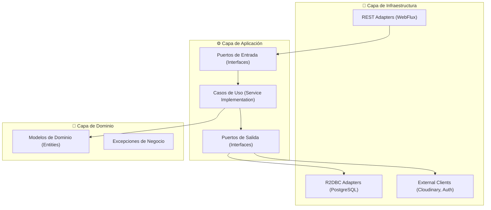

# 💼 Guía de Estándares para Microservicios

## 📑 CONTEXTOS DE REFERENCIA

### 🏢 PRS1: SIGEI (Sistema de Gestión Educativa Inicial)

**Gestión de Notas y Asistencia para Colegios Iniciales**

El proyecto **SIGEI** está diseñado para gestionar de manera integral los procesos administrativos y educativos en colegios de nivel inicial. A través de una arquitectura de microservicios escalable de forma horizontal, SIGEI facilita la administración de matrícula, gestión de aulas, control de asistencia, manejo de eventos (días festivos, incidentes como huaicos), gestión académica, atención psicológica, y registro de incidencias entre los alumnos. Además, permite una gestión eficiente de las instituciones educativas, todo con un enfoque modular que asegura un alto nivel de flexibilidad y crecimiento.

---

### 📦 PRS2: SIPREB (Sistema de Gestión de Bienes Patrimoniales)

**Control y Seguimiento de Bienes Institucionales**

El **Sistema de Gestión de Bienes Patrimonial (SIPREB)** es una solución integral para la administración del ciclo de vida de los bienes institucionales, que permite registrar, controlar y dar seguimiento a los activos desde su alta hasta su baja formal. Automatiza procesos clave como la depreciación, gestiona movimientos y transferencias entre áreas, y asegura la trazabilidad completa de cada bien mediante auditoría y control de estados. Su objetivo principal es garantizar la transparencia, el orden patrimonial y el cumplimiento normativo en la gestión de activos institucionales.

#### **🎯 Objetivos de SIPREB**

- 📍 **Trazabilidad**: Conocer la ubicación y responsable de cada bien en tiempo real.
- 🤖 **Automatización**: Eliminar cálculos manuales mediante algoritmos reactivos.
- 🔒 **Control**: Gestionar procesos de baja con resoluciones y dictámenes técnicos.
- 📊 **Transparencia**: Auditoría completa del ciclo de vida de los activos.

---


## 📋 Tabla de Contenidos

1. [Resumen Ejecutivo](#-resumen-ejecutivo)
2. [Tecnologías y Frameworks](#-tecnologías-y-frameworks)
3. [Arquitectura de los Contextos](#-arquitectura-de-los-contextos)
4. [Estructura del Proyecto](#-estructura-del-proyecto)
5. [Estándares de Codificación](#estándares-de-codificación)
6. [Códigos de Estado HTTP](#-códigos-de-estado-http)
7. [Seguridad y Autenticación](#-seguridad-y-autenticación)
8. [Comunicación entre Microservicios](#-comunicación-entre-microservicios)
9. [Gestión de Datos](#-gestión-de-datos)
10. [Infraestructura y Despliegue](#-infraestructura-y-despliegue)

---

## 🎯 Resumen Ejecutivo

### Arquitectura General Backend

- **Patrón**: Microservicios con Arquitectura Hexagonal (Domain-Driven Design Lite).
- **Comunicación**: HTTP/REST Reactivo (Spring WebFlux) + WebClient.
- **Seguridad**: OAuth2 Resource Server con JWT (Keycloak/Spring Security).
- **Base de Datos**: PostgreSQL (VPS) con persistencia reactiva (R2DBC).
- **Lenguaje**: Java 17 con Spring Boot 3.5.x.
- **Infraestructura**: Docker + Docker Compose para orquestación local.

---

## ⚙️ Tecnologías y Frameworks

### Backend Technologies Stack

#### **Core Framework**
- **Spring Boot**: `3.5.x` (Versión estandarizada)
- **Java**: `17` (LTS)
- **Maven**: Gestor de dependencias y automatización de builds.

#### **Base de Datos y Persistencia**
```xml
<!-- PostgreSQL Reactive (R2DBC) -->
<dependency>
    <groupId>org.springframework.boot</groupId>
    <artifactId>spring-boot-starter-data-r2dbc</artifactId>
</dependency>
<dependency>
    <groupId>org.postgresql</groupId>
    <artifactId>r2dbc-postgresql</artifactId>
</dependency>
```

#### **Integraciones y Resiliencia (Opcional)**
- **Cloudinary / S3**: Gestión de archivos y medios.
- **Resilience4j**: Manejo de fallos con Circuit Breaker.
- **Dotenv**: Gestión de variables de entorno.

---

## 📁 Estructura del Proyecto

### 📂 Estructura Unificada (Arquitectura Hexagonal)

```
vg-ms-{service}/
├── 📄 pom.xml                            # Configuración Maven
├── 📄 Dockerfile                         # Imagen Docker multi-stage
├── 📄 README.md                          # Documentación del microservicio
├── 📁 src/
    ├── 📁 main/
    │   ├── 📁 java/pe/edu/vallegrande/{package}/
    │   │   ├── 📄 {Service}Application.java           # Main Class
    │   │   │
    │   │   ├── 📁 domain/                             # 🎯 CAPA DE DOMINIO (Core)
    │   │   │   ├── 📁 model/                          # Entidades puras (POJOs)
    │   │   │   └── 📁 exception/                      # Excepciones de negocio
    │   │   │
    │   │   ├── 📁 application/                        # ⚙️ CAPA DE APLICACIÓN
    │   │   │   ├── 📁 ports/                          # Puertos (Interfaces)
    │   │   │   │   ├── 📁 input/                      # Casos de uso (UseCases)
    │   │   │   │   └── 📁 output/                     # Contratos de salida
    │   │   │   ├── 📁 services/                       # Implementación de casos de uso
    │   │   │   └── 📁 dto/                            # Data Transfer Objects (Req/Res)
    │   │   │
    │   │   └── 📁 infrastructure/                     # 🔧 CAPA DE INFRAESTRUCTURA
    │   │       ├── 📁 adapters/
    │   │       │   ├── 📁 input/rest/                 # Controladores REST
    │   │       │   └── 📁 output/                     # Persistencia y Clientes Externos
    │   │       ├── 📁 config/                         # Configuración de Beans/Security
    │   │       └── 📁 persistence/                    # Repositorios R2DBC
    │   │
    │   └── 📁 resources/
    │       ├── 📄 application.yml                     # Configuración principal
    │       └── 📁 db/                                 # Scripts SQL / Migraciones
```

---

## ⚖️ Estándares de Codificación

### **Anotaciones de Calidad**
- `@Data`, `@Builder`, `@NoArgsConstructor`, `@AllArgsConstructor`: Mediante **Lombok** para reducir código repetitivo.
- `@Slf4j`: Para logging estandarizado.
- `@Valid`: Validación de DTOs en la capa de entrada.

### **Controladores Reactivos**
```java
@RestController
@RequestMapping("/api/v1/{context}")
public class AssetRestController {
    @PostMapping
    public Mono<ResponseEntity<AssetResponse>> create(@Valid @RequestBody AssetRequest request) {
        return useCase.execute(request)
            .map(res -> ResponseEntity.status(HttpStatus.CREATED).body(res));
    }
}
```

---

## 🚥 Códigos de Estado HTTP

El sistema utiliza los siguientes códigos de estado estándar para las respuestas de la API:

| Código | Estado | Descripción |
| :--- | :--- | :--- |
| **200** | `OK` | La solicitud se procesó correctamente y se devuelve la información solicitada. |
| **201** | `Created` | El recurso ha sido creado exitosamente. |
| **204** | `No Content` | La solicitud se procesó con éxito pero no devuelve contenido. |
| **400** | `Bad Request` | La solicitud es inválida o contiene errores de validación. |
| **401** | `Unauthorized` | No se proporcionaron credenciales válidas o el token ha expirado. |
| **403** | `Forbidden` | El usuario no tiene permisos suficientes para realizar la acción. |
| **404** | `Not Found` | El recurso solicitado no pudo ser encontrado en el sistema. |
| **500** | `Internal Server Error` | Se produjo un error inesperado en el servidor. |

---

## 🔐 Seguridad y Autenticación

Los microservicios implementan seguridad basada en **OAuth2 Resource Server** para proteger los recursos de cada contexto.

- **Mecanismo**: Validación de tokens JWT emitidos por Keycloak.
- **Filtros**: Interceptores de seguridad para propagar el contexto de autenticación en llamadas internas.
- **Configuración**:
```yaml
spring:
  security:
    oauth2:
      resourceserver:
        jwt:
          issuer-uri: ${KEYCLOAK_ISSUER_URI}
          jwk-set-uri: ${KEYCLOAK_JWK_SET_URI}
```

---

## 🔄 Comunicación entre Microservicios

Se utiliza comunicación síncrona reactiva para interactuar con otros servicios del ecosistema (como Users Management o Configuration Service).

- **Herramienta**: `WebClient` de Spring WebFlux.
- **Propagación**: Los tokens JWT son propagados automáticamente en los headers de las peticiones salientes para mantener la identidad del usuario a través de la red.

---

## 🏗️ Arquitectura de los Contextos

Se aplica **Arquitectura Hexagonal (Puertos y Adaptadores)** para desacoplar el núcleo del negocio de los detalles técnicos.



---
Se implementan Dockerfiles multi-stage para optimizar el tamaño de las imágenes finales (< 250 MiB).

```dockerfile
# Stage 1: Build
FROM maven:3.9.0-eclipse-temurin-17-alpine AS builder
COPY . .
RUN mvn clean package -DskipTests

# Stage 2: Runtime
FROM eclipse-temurin:17-jre-alpine
COPY --from=builder /app/target/*.jar app.jar
ENTRYPOINT ["java", "-jar", "app.jar"]
```


> **Nota**: Este documento ha sido generado siguiendo los estándares unificados de documentación de microservicios de Valle Grande.
