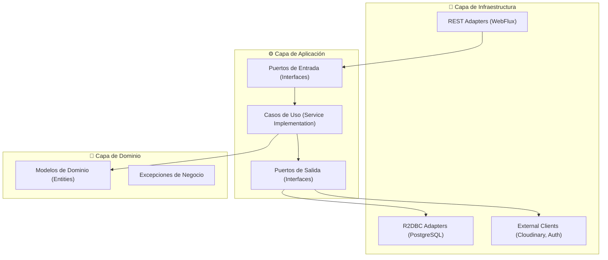

# 💼 Descripción General de los PRS (Institución y Patrimonio)

## 📑 PROYECTO PRS01: SISTEMA DE GESTIÓN INSTITUCIONAL (SCHOOL)

**Gestión Integral de Instituciones Educativas y Recursos**

### 📋 Descripción del Proyecto

El **Sistema de Gestión Institucional** es una plataforma diseñada para digitalizar y centralizar la administración de instituciones educativas. Este microservicio (`vg-ms-institution-management`) permite la gestión eficiente de locales, aulas, horarios y clasificaciones institucionales, asegurando una estructura organizativa sólida y escalable.

### 🎯 Objetivos del Sistema

- **Centralización**: Administrar múltiples sedes y aulas desde un único punto.
- **Optimización**: Mejor gestionamiento de horarios y recursos físicos.
- **Escalabilidad**: Soportar el crecimiento de la red educativa de manera modular.

---

## 📑 PROYECTO PRS02: SISTEMA DE GESTIÓN PATRIMONIAL (ASSETS)

**Control y Seguimiento de Bienes Institucionales**

### 📋 Descripción del Proyecto

El **Sistema de Gestión Patrimonial** (`vg-ms-patrimonioservice`) es una solución especializada en el ciclo de vida de los activos institucionales. Desde el registro inicial y el cálculo de depreciaciones automáticas hasta el proceso formal de baja de bienes, el sistema garantiza la transparencia y el cumplimiento normativo en la gestión de la propiedad.

### 🎯 Objetivos del Sistema

- **Trazabilidad**: Conocer la ubicación y responsable de cada bien en tiempo real.
- **Automatización**: Eliminar cálculos manuales de depreciación mediante algoritmos lineales reactivos.
- **Control**: Gestionar procesos de baja con resoluciones y dictámenes técnicos integrados.

---

## 📋 Tabla de Contenidos

1. [Resumen Ejecutivo](#-resumen-ejecutivo)
2. [Tecnologías y Frameworks](#-tecnologías-y-frameworks)
3. [Arquitectura del Sistema](#-arquitectura-del-sistema)
4. [Estructura del Proyecto](#-estructura-del-proyecto)
5. [Estándares de Codificación](#estándares-de-codificación)
6. [Seguridad y Autenticación](#-seguridad-y-autenticación)
7. [Comunicación entre Microservicios](#-comunicación-entre-microservicios)
8. [Gestión de Datos](#-gestión-de-datos)
9. [Infraestructura y Despliegue](#-infraestructura-y-despliegue)

---

## 🎯 Resumen Ejecutivo

### Arquitectura General Backend

- **Patrón**: Microservicios con Arquitectura Hexagonal (Domain-Driven Design Lite).
- **Comunicación**: HTTP/REST Reactivo (Spring WebFlux) + WebClient.
- **Seguridad**: OAuth2 Resource Server con JWT (Keycloak/Spring Security).
- **Base de Datos**: PostgreSQL (Neon) con persistencia reactiva (R2DBC).
- **Lenguaje**: Java 17 con Spring Boot 3.5.x.
- **Infraestructura**: Docker + Docker Compose para orquestación local.

---

## ⚙️ Tecnologías y Frameworks

### Backend Technologies Stack

#### **Core Framework**
- **Spring Boot**: `3.5.11` (PRS1) / `3.5.6` (PRS2)
- **Java**: `17` (LTS)
- **Maven**: Gestor de dependencias y automatización de builds.

#### **Base de Datos y Persistencia**
```xml
<!-- PostgreSQL Reactive (R2DBC) -->
<dependency>
    <groupId>org.springframework.boot</groupId>
    <artifactId>spring-boot-starter-data-r2dbc</artifactId>
</dependency>
<dependency>
    <groupId>org.postgresql</groupId>
    <artifactId>r2dbc-postgresql</artifactId>
</dependency>
```

#### **Integraciones y Resiliencia**
- **Cloudinary**: Gestión de archivos y medios (PRS1).
- **Resilience4j**: Manejo de fallos con Circuit Breaker (PRS1).
- **Dotenv**: Gestión de variables de entorno (PRS2).

---

## 📁 Estructura del Proyecto

### 📂 Estructura Unificada (Arquitectura Hexagonal)

```
vg-ms-{service}/
├── 📄 pom.xml                            # Configuración Maven
├── 📄 Dockerfile                         # Imagen Docker multi-stage
├── 📄 README.md                          # Documentación del microservicio
├── 📁 src/
    ├── 📁 main/
    │   ├── 📁 java/pe/edu/vallegrande/{package}/
    │   │   ├── 📄 {Service}Application.java           # Main Class
    │   │   │
    │   │   ├── 📁 domain/                             # 🎯 CAPA DE DOMINIO (Core)
    │   │   │   ├── 📁 model/                          # Entidades puras (POJOs)
    │   │   │   └── 📁 exception/                      # Excepciones de negocio
    │   │   │
    │   │   ├── 📁 application/                        # ⚙️ CAPA DE APLICACIÓN
    │   │   │   ├── 📁 ports/                          # Puertos (Interfaces)
    │   │   │   │   ├── 📁 input/                      # Casos de uso (UseCases)
    │   │   │   │   └── 📁 output/                     # Contratos de salida
    │   │   │   ├── 📁 services/                       # Implementación de casos de uso
    │   │   │   └── 📁 dto/                            # Data Transfer Objects (Req/Res)
    │   │   │
    │   │   └── 📁 infrastructure/                     # 🔧 CAPA DE INFRAESTRUCTURA
    │   │       ├── 📁 adapters/
    │   │       │   ├── 📁 input/rest/                 # Controladores REST
    │   │       │   └── 📁 output/                     # Persistencia y Clientes Externos
    │   │       ├── 📁 config/                         # Configuración de Beans/Security
    │   │       └── 📁 persistence/                    # Repositorios R2DBC
    │   │
    │   └── 📁 resources/
    │       ├── 📄 application.yml                     # Configuración principal
    │       └── 📁 db/                                 # Scripts SQL / Migraciones
```

---

## ⚖️ Estándares de Codificación

### **Anotaciones de Calidad**
- `@Data`, `@Builder`, `@NoArgsConstructor`, `@AllArgsConstructor`: Mediante **Lombok** para reducir código repetitivo.
- `@Slf4j`: Para logging estandarizado.
- `@Valid`: Validación de DTOs en la capa de entrada.

### **Controladores Reactivos**
```java
@RestController
@RequestMapping("/api/v1/{context}")
public class AssetRestController {
    @PostMapping
    public Mono<ResponseEntity<AssetResponse>> create(@Valid @RequestBody AssetRequest request) {
        return useCase.execute(request)
            .map(res -> ResponseEntity.status(HttpStatus.CREATED).body(res));
    }
}
```

---

## 🔐 Seguridad y Autenticación

Ambos PRS implementan seguridad basada en **OAuth2 Resource Server** para proteger los recursos institucionales.

- **Mecanismo**: Validación de tokens JWT emitidos por Keycloak.
- **Filtros**: Interceptores de seguridad para propagar el contexto de autenticación en llamadas internas.
- **Configuración**:
```yaml
spring:
  security:
    oauth2:
      resourceserver:
        jwt:
          issuer-uri: ${KEYCLOAK_ISSUER_URI}
          jwk-set-uri: ${KEYCLOAK_JWK_SET_URI}
```

---

## 🔄 Comunicación entre Microservicios

Se utiliza comunicación síncrona reactiva para interactuar con otros servicios del ecosistema (como Users Management o Configuration Service).

- **Herramienta**: `WebClient` de Spring WebFlux.
- **Propagación**: Los tokens JWT son propagados automáticamente en los headers de las peticiones salientes para mantener la identidad del usuario a través de la red.

---

## 🏗️ Arquitectura del Sistema

Se aplica **Arquitectura Hexagonal (Puertos y Adaptadores)** para desacoplar el núcleo del negocio de los detalles técnicos.



---
Se implementan Dockerfiles multi-stage para optimizar el tamaño de las imágenes finales (< 250 MiB).

```dockerfile
# Stage 1: Build
FROM maven:3.9.0-eclipse-temurin-17-alpine AS builder
COPY . .
RUN mvn clean package -DskipTests

# Stage 2: Runtime
FROM eclipse-temurin:17-jre-alpine
COPY --from=builder /app/target/*.jar app.jar
ENTRYPOINT ["java", "-jar", "app.jar"]
```

### Endpoints Principales

#### **PRS 1: Institución**
- `GET /api/v1/institutions`: Gestión de instituciones.
- `GET /api/v1/classrooms`: Gestión de aulas.

#### **PRS 2: Patrimonio**
- `GET /api/v1/assets`: Inventario de bienes.
- `POST /api/v1/depreciations`: Cálculo de depreciación.
- `POST /api/v1/asset-disposals`: Flujo de bajas.

---
> **Nota**: Este documento ha sido generado siguiendo los estándares unificados de documentación de microservicios para los proyectos PRS de Valle Grande.
